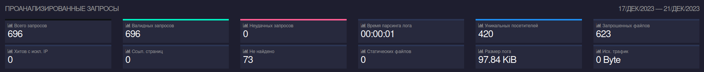
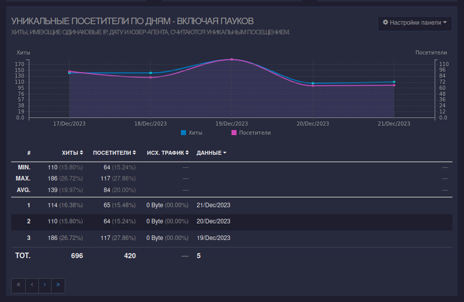
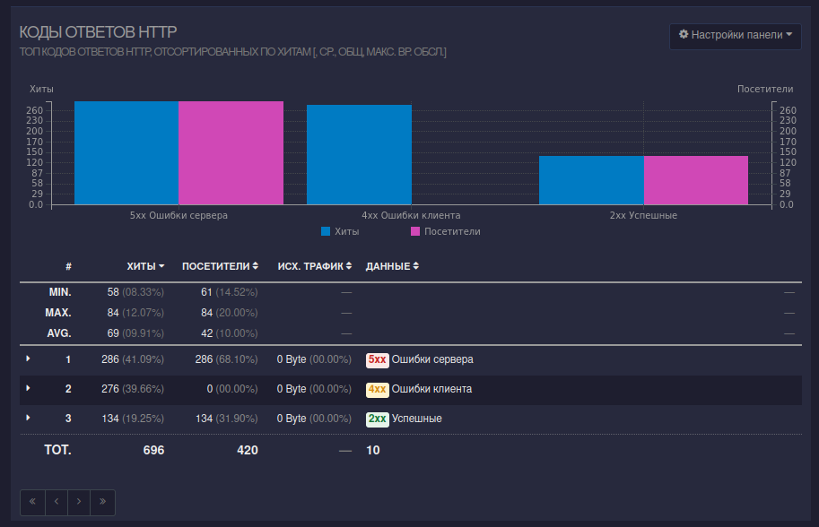
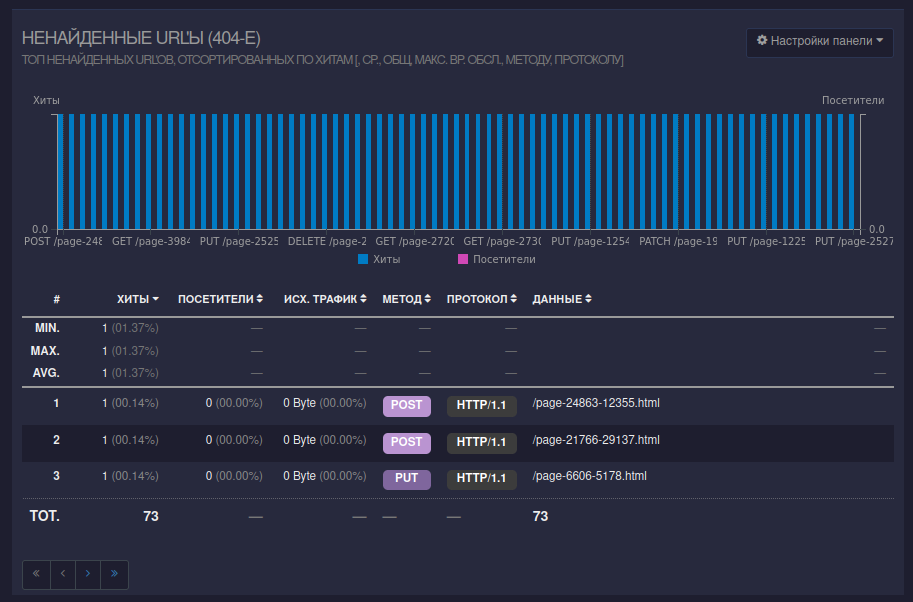

# GoAccess

## Установка

`sudo apt update; sudo apt install goaccess -y`

## Запуск

Код находится в `main.sh`

## Все записи

## Все уникальные IP, встречающиеся в записях

## Все запросы

## Все уникальные IP, которые встречаются среди ошибочных запросов

## Так же в инструменте есть

Так же в инструменте можно посмотреть список всех запрошенных url, статические запросы, имена хостов и ip посетителей, операционные системы, браузеры, распределение по времени, ссылающиеся сайты и удалённых пользователей
