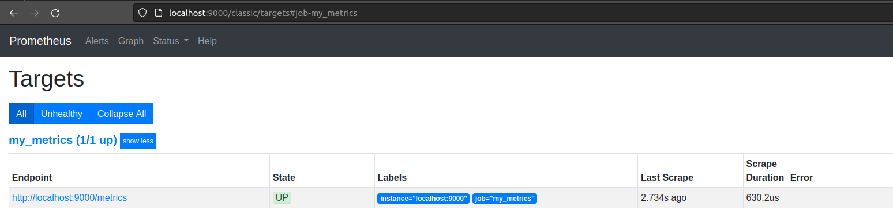
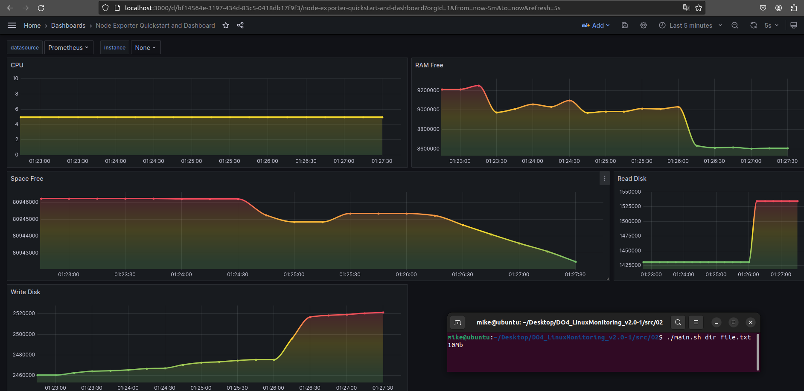
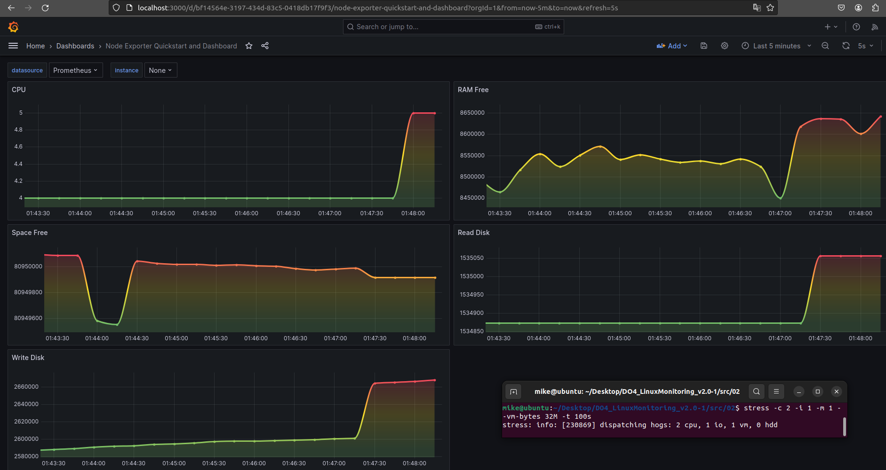

# Свой node_exporter

## Скрипт main.sh

Код скрипта можно увидеть в файле

Скрипт нужно запускать от имени суперпользователя, так как запись идёт в файл `index.html` в папках `nginx`

## Переписываем prometheus.yml

Добавляем следующие строчки:

```
  - job_name: my_metrics
    static_configs:
      - targets: ['localhost:9000']
```

И комментируем  остальные строки `job`

## Редактируем nginx.conf

Сделаем вывод сервера на порт `9000`

Папкой сайта сделаем `/usr/share/nginx/html`

По `/` сделаем вывод Prometheus, для удобства

По `/metrics` сделаем вывод нашего скрипта

## Далее

Перезапускаем сервисы `prometheus` и `grafana`

## Что получилось



## Запуск скрипта из задания 2



## Запуск теста stress

